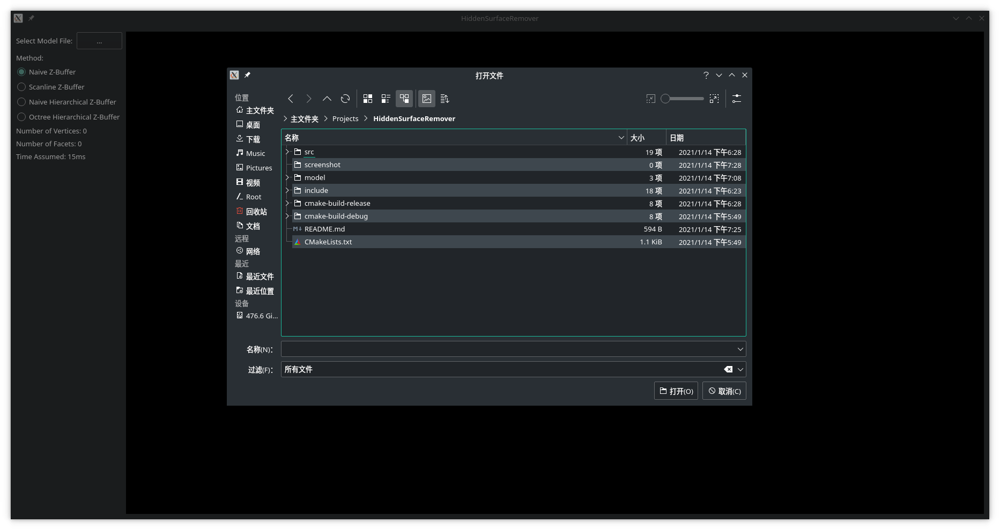
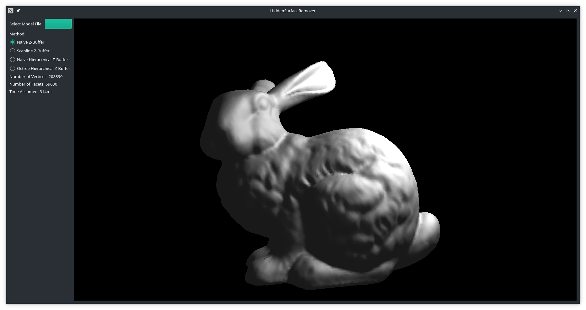
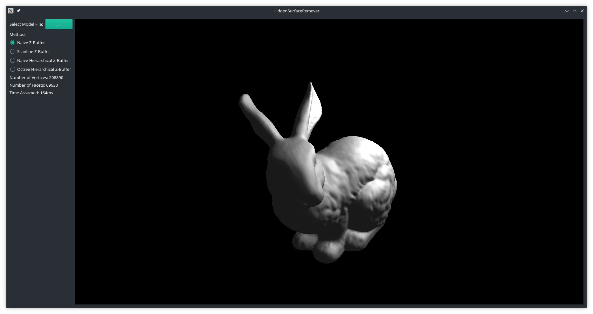

# HiddenSurfaceRemover

## 简介

本程序实现了普通Z-Buffer、扫描线Z-Buffer、普通层次Z-Buffer以及带场景八叉树的层次Z-Buffer四种算法。
并将它们用于三维模型的渲染。所有代码都为自行实现，除第三方库外并未借鉴他人代码。

## 开发环境

本程序的开发环境如下表所示。

|项目|值|
|:---:|:---:|
|CPU|Intel® Core™ i7-8550U|
|内存|7.7GB|
|操作系统|Manjaro Linux|

本程序开发时用到的一些软件和库以及它们的版本如下表所示。

|软件/库|版本|
|:---:|:---:|
|Linux内核|5.4.85|
|GCC|10.2.0|
|CMake|3.17.5|
|Assimp|5.0.1|
|Qt|5.15.2|

其中Assimp用于模型的导入；Qt用于相关的数学计算，如模型的旋转、透视投影，并且提供图形用户界面和显示绘制结果。

## 使用说明

- 编译并运行程序后，可以点击窗口左上角的按钮选择要绘制的模型文件，支持的模型文件格式详见Assimp库的文档。
- 选择模型文件后，绘制的结果会显示在窗口右侧的部分。
- 在绘制部分点击鼠标左键或右键并拖动，可以对模型进行旋转；滑动鼠标滚轮，可以对模型进行缩放。
- 在左侧的单选框还可以对使用的Z-Buffer算法进行选择，每次选择后，模型都会被重新绘制，旋转和缩放会被重置。
- 单选框下方会显示模型的顶点数、面元数以及渲染一帧所用的时间。

## 运行截图

## 类说明

程序中的一些主要的类及它们的说明如下表所示。

|类|说明|
|:---:|:---:|
|ZBuffer|Z-Buffer算法的基类|
|NaiveZBuffer|普通Z-Buffer算法|
|ScanlineZBuffer|扫描线Z-Buffer算法|
|NaiveHierarchicalZBuffer|普通层次Z-Buffer算法|
|OctreeHierarchicalZBuffer|带场景八叉树的层次Z-Buffer算法|
|Polygon|多边形|
|ActivePolygon|活化多边形|
|Edge|多边形的边|
|ActiveEdge|活化边|
|Segment|扫描线与多边形的相交线段|
|ActiveSegment|活化线段|
|QuadTree|层次Z-Buffer，即四叉树|
|Octree|场景八叉树|
|Model|用于存储三维模型|

## 算法简介

- 光照模型：本程序使用了Blinn-Phong光照模型，且在场景中设置了一个点光源。
- 普通Z-Buffer算法：直接光栅化所有多边形，并根据光栅化的结果更新Z缓存和帧缓存。
- 扫描线Z-Buffer算法：从上到下扫描每一行像素，在这一过程中维护与扫描线相交的多边形和边，并根据相交线段更新Z缓存和帧缓存。
- 普通层次Z-Buffer算法：使用四叉树维护Z缓存，将所有多边形依次在四叉树中进行查询。查询时找到包含这一多边形的深度最大的四叉树节点，如果通过了深度测试，就将多边形光栅化，并将光栅化得到的像素在这一子树中继续进行查询。
- 带场景八叉树的层次Z-Buffer算法：在普通层次Z-Buffer算法的基础上，把所有的多边形使用场景八叉树维护，然后将场景八叉树在四叉树中进行查询。一开始两棵树都位于根节点中，每次先将八叉树中属于当前节点的多边形进行光栅化，然后在四叉树中进行查询。之后再对八叉树的子节点进行递归，递归的同时要在四叉树中移动到相对应的节点。

## 算法比较

在model文件夹中存放了用于进行算法比较的模型，它们所含的顶点数和面元数如下表所示。

|模型文件|顶点数|面元数|
|:---:|:---:|:---:|
|cube.obj|36|12|
|suzanne.obj|2904|968|
|bunny.obj|208890|69630|
|armadillo.obj|637721|212574|

各个模型使用各种算法绘制所需的时间如下表所示。

|用时(ms)|cube.obj|suzanne.obj|bunny.obj|armadillo.obj|
|:---:|:---:|:---:|:---:|:---:|
|普通Z-Buffer算法|111|82|256|327|
|扫描线Z-Buffer算法|81|61|254|446|
|普通层次Z-Buffer算法|647|585|1107|983|
|带场景八叉树的层次Z-Buffer算法|661|555|1001|1358|

可以看到，虽然在各种测试情况下层次Z-Buffer算法都比普通的Z-Buffer算法用时更多，但层次Z-Buffer的用时随模型复杂度增加增长的速度较慢。从算法原理来看，层次Z-Buffer更适用于多边形多、多边形之间遮挡关系较多时的情形，并且更易于并行化。